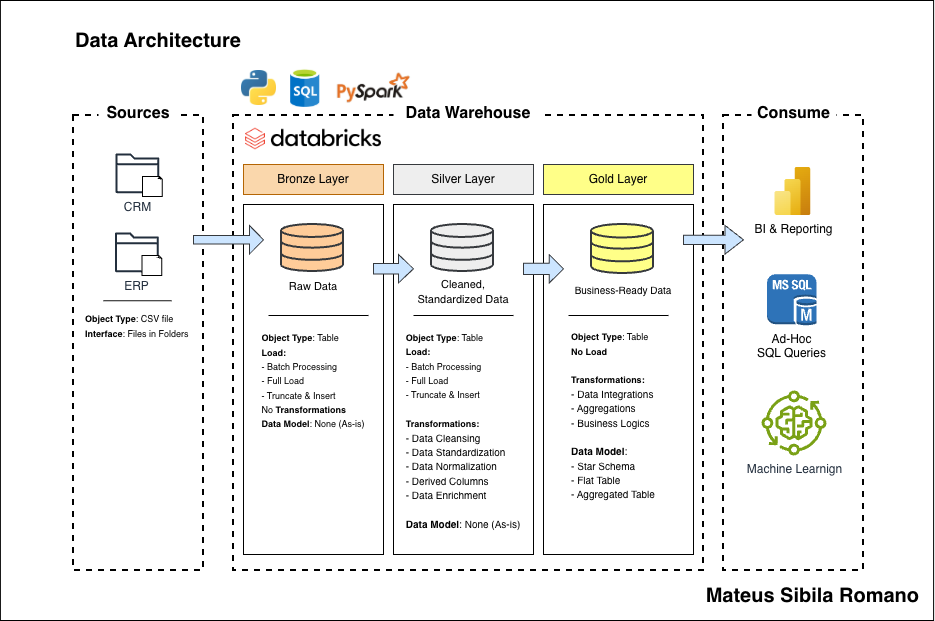

# Data Warehouse and Analytics Project – Databricks Edition

Welcome to the **Data Warehouse and Analytics Project** repository, now implemented on **Databricks**!  
This project demonstrates a full end-to-end **Medallion Architecture data pipeline**, from raw data ingestion to business-ready analytics, using Databricks as the data platform.  

Designed as a portfolio project, it highlights modern **data engineering**, **data analytics**, and **data modeling** practices.

---

## 🏗️ Data Architecture

The data architecture follows **Medallion Architecture** with **Bronze**, **Silver**, and **Gold** layers:



1. **Bronze Layer**: Stores raw data ingested directly from CSV files into Databricks **Delta Tables**.
2. **Silver Layer**: Cleans, standardizes, and enriches the data, making it ready for analytical transformations.
3. **Gold Layer**: Provides business-ready datasets, modeled in **star schemas** and **views** for reporting, dashboards, and analytics.

---

## 📖 Project Overview

This Databricks project includes:

1. **Data Architecture**: Implementation of Bronze, Silver, and Gold layers using **Delta Lake**.
2. **ETL Pipelines**: Data ingestion, transformation, and loading pipelines using **PySpark**, **SQL**, and **Databricks notebooks**.
3. **Data Modeling**: Creation of fact and dimension tables for efficient analytical queries.
4. **Analytics & Reporting**: Generating SQL-based reports and dashboards on Databricks, ready for BI tools or further analysis.
5. **GitHub Integration**: Project notebooks and scripts are version-controlled, and final pipeline commits are pushed to GitHub.

🎯 This repository is a great reference for anyone wanting to showcase skills in:

- Databricks & Delta Lake  
- PySpark and SQL development  
- Data Engineering & ETL pipelines  
- Data Modeling & Analytics  
- Data Warehousing using Medallion Architecture  

---

## 🛠️ Important Links & Tools

- **[Datasets](data/):** Access to CSV files used in the project.  
- **[Databricks Free Edition](https://www.databricks.com/try-databricks):** Cloud-based data platform for running notebooks, Spark jobs, and managing Delta tables.  
- **[Databricks Documentation](https://docs.databricks.com/):** Learn more about Databricks platform features.  
- **[DrawIO](https://www.drawio.com/):** Create architecture, data flow, and model diagrams.  
- **[Databricks Academy](https://academy.databricks.com/):** Courses to deepen your understanding of Databricks, data engineering, and machine learning.
- **[YouTube](https://www.youtube.com/watch?v=SSKVgrwhzus):** Baraa's video - SQL Full Course (30 Hours).  
- **[YouTube](https://www.youtube.com/watch?v=9GVqKuTVANE):** Baraa's video - SQL Data Warehouse with SQL Server.  
- **[YouTube](https://www.youtube.com/watch?v=X5zTCgPN_D4):** Baraa's video - What is Databricks?

---

## 🚀 Project Requirements

### Building the Data Warehouse (Data Engineering)

#### Objective
Develop a modern data warehouse on Databricks, consolidating sales and CRM data into a robust analytics pipeline.

#### Specifications
- **Data Sources**: Import data from CSV files into **Delta Tables**.  
- **Data Quality**: Clean and standardize data in the Silver layer.  
- **Integration**: Combine multiple sources into a unified analytical data model.  
- **Documentation**: Include clear diagrams and notebook explanations for each stage.  

---
## 📂 Repository Structure
```
data-warehouse-databricks/
│
├── data/                        # Raw CSV datasets used as sources for the pipeline
│
├── docs/                        # Project documentation and diagrams
│   ├── data_architecture.png    # Diagram showing Bronze, Silver, and Gold layers
│   ├── data_flow.png            # Data flow diagram across the pipeline
│   ├── data_integration.png     # Diagram of how different sources are integrated
│   ├── data_model.png           # Star schema and dimensional data model
│
├── exploration/                 # Notebooks for data exploration and initial analysis
│
├── pipelines/                   # ETL pipelines for each Medallion layer
│   ├── setup/                   # Notebooks or scripts for initializing schemas and tables
│   ├── bronze/                  # Ingestion of raw CSV files into Bronze Delta tables
│   ├── silver/                  # Cleaning, standardization, and transformation to Silver tables
│   ├── gold/                    # Creation of fact and dimension tables for Gold layer analytics
│
├── README.md                    # Project overview, instructions, and documentation
├── LICENSE                      # License information for the repository
└── .gitignore                   # Files and directories ignored by Git in GitHub
```

---

## 🌟 About Me

Hi there! I'm **Mateus Sibila**, a Data Analyst with hands-on experience in Data Engineering. I work with data pipelines, SQL, and analytics projects, transforming raw data into clean, reliable, and well-structured datasets that drive insights and support decision-making.  

Let’s stay in touch! Feel free to connect with me on the following platforms:

[](https://www.linkedin.com/in/mateussibilaromano/)
[](https://github.com/mateussibila)
